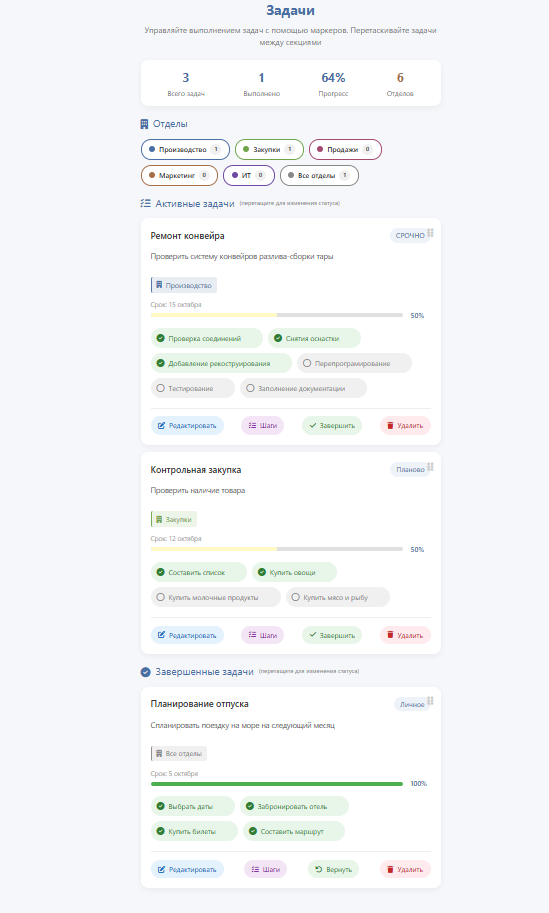

# Портфолио

**Здесь представленно портфелио студента Поволжского государственного университета сервиса Бойко Степана Валериевича пет-проектов. В удобной форме, для просмотра.**

## Содержание 
1. [Crearive.Tech](#title_creative_tech)
2. [Бот Discord](#title_bot_discord)
3. [Бот Telegram](#title_bot_discord)
## Проекты
 #### <a id="title_creative_tech">Creative.Tech 4.0</a>
 Создание no-code платформы для производства, в рамках акселерационной программы Creative.Tech 4.0

[Ссылка на просмотр проекта](https:akash1st.github.io/no-code_project)
_доп. сслыка для открытия проекта https:akash1st.github.io/no-code_project_

#### <a id="title_bot_discord">Бот Discord</a>

Мини пет-проект по созданию Discord бота для игрового сообщества, с простым функционалом ведения чата и некоторыми необходимым функциями для владельца сообщества.

[ПАПКА БОТА](DisBot)

#### <a id="title_bot_telegram">Бот Telegram</a>

Мини пет-проект по созданию Telegram эхо-бота с простыми задачами запроса и командами

[ПАПКА БОТА](TelegramBot)
